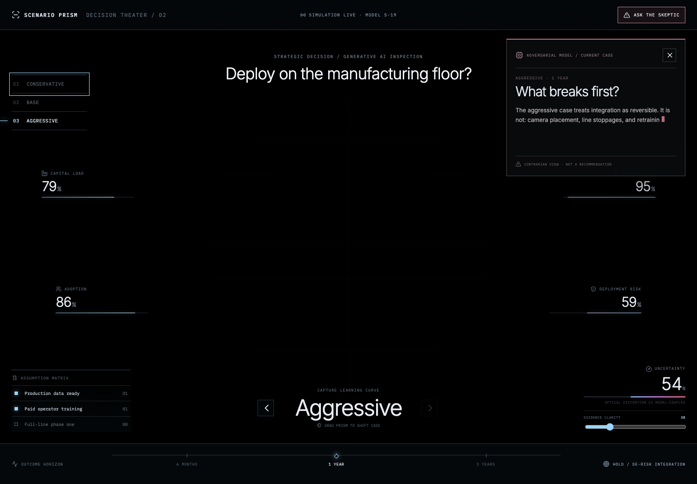
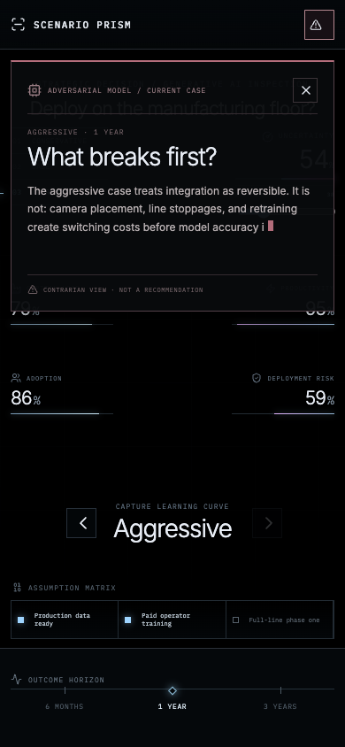

# Scenario Prism

**AI Strategy Decision Theater** — a cinematic strategy simulation for seeing how assumptions, evidence, and uncertainty reshape a manufacturing AI deployment decision.

## Art direction

Scenario Prism is designed as a dark executive simulation chamber: one monumental optical object, sparse industrial instrumentation, spectral dispersion, and a timeline console. UI chrome is intentionally minimal and numeric changes are coupled to the same state that deforms the prism and camera.

## Core interactions

- Drag or select the central prism to switch Conservative / Base / Aggressive cases.
- 6-month, 1-year, and 3-year outcome horizon.
- Assumption toggles deform the prism and recalculate cost, productivity, risk, adoption, and uncertainty.
- `MeshTransmissionMaterial` plus postprocessing makes uncertainty physically visible as optical distortion.
- Evidence strength directly controls material roughness, fog, aberration, Bloom and Depth of Field clarity.
- `maath` damping couples scenario transitions to camera and object motion.
- Streaming `Ask the Skeptic` adversarial analysis.
- CSS fallback when WebGL is unavailable, reduced-motion handling, low-power DPR/effect reduction, and off-screen frameloop suspension.

## Visual reference adoption

The required catalog is preserved verbatim at [`docs/visual-reference-catalog.md`](docs/visual-reference-catalog.md). Detailed README/LICENSE/demo checks, local implementation comparisons and adoption decisions live in [`docs/reference-adoption.md`](docs/reference-adoption.md).

### Latest captures





## Run locally

```bash
corepack pnpm install
corepack pnpm dev
```

Open http://localhost:3102.

## Quality checks

```bash
corepack pnpm typecheck
corepack pnpm lint
corepack pnpm build
```

The repository is fully self-contained and has no workspace dependency on `ai-ux-mvp-lab`.
