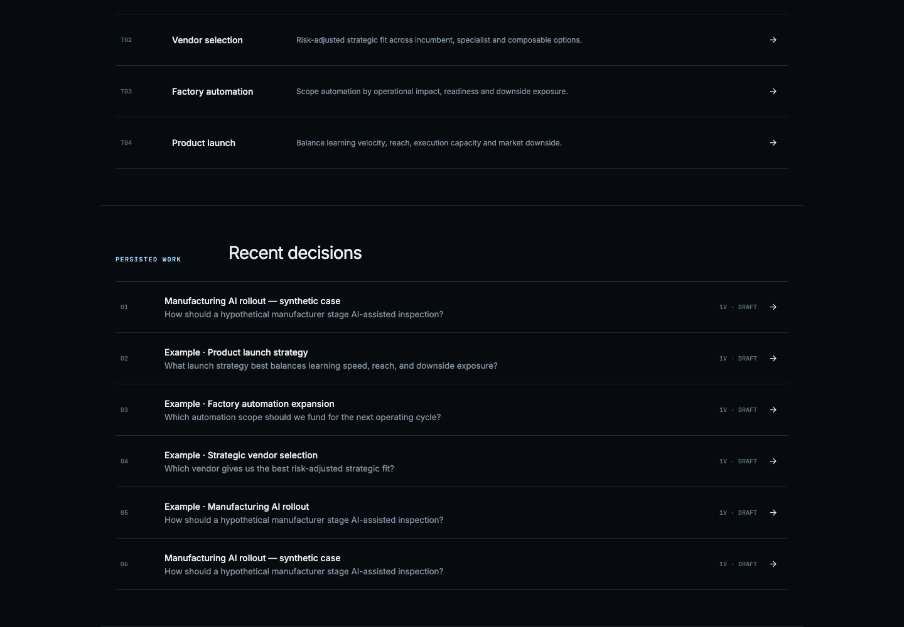
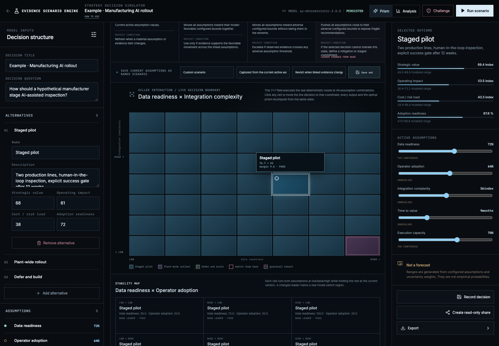
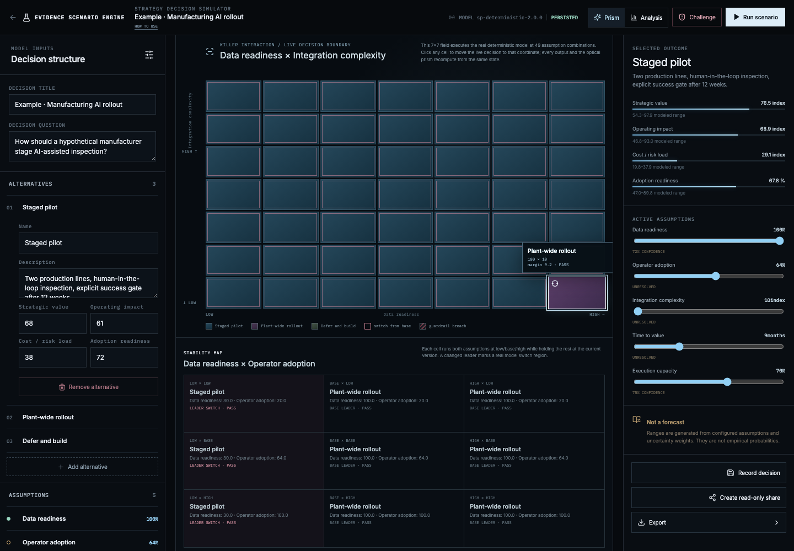
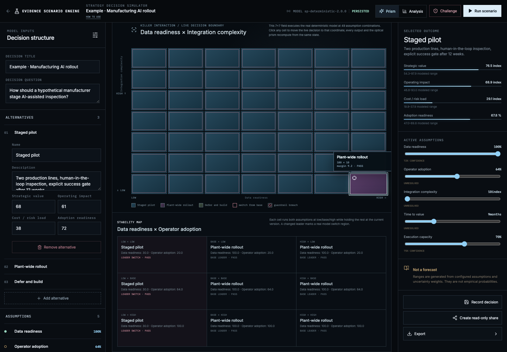
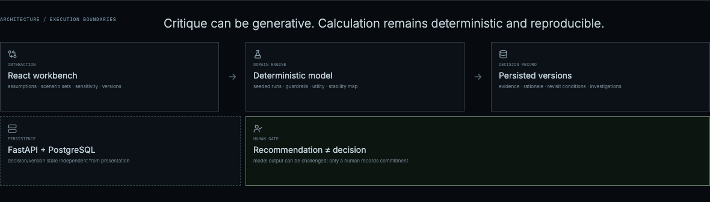

# Evidence Scenario Engine

The workbench now supports persistent multi-assumption **named scenario sets** (Base / Upside / Downside / Stress plus custom sets), a scenario matrix, deterministic recommendation-stability comparison, a paired-assumption stability map that exposes leader-switch regions, and a Validation Priority → evidence investigation workflow. Scenario rationale and revisit conditions are stored and compared alongside the model outputs.

Evidence Scenario Engine is a full-stack decision workbench for comparing alternatives under explicit assumptions, evidence strength, uncertainty, and decision guardrails.

## Portfolio case study

Evidence Scenario Engine is an independent decision-modeling experiment around one question: **can a decision tool show not only what wins, but when and why the winner changes?** A fresh deployment now persists four example decisions—manufacturing AI rollout, vendor selection, factory automation, and product launch—so the product opens with inspectable decision state rather than an empty recent-work list.

The case study is organized as **Before → Problem → Insight → Architecture → Interaction → Result** and makes the model boundary explicit: numeric output is deterministic under declared assumptions; generated critique is kept outside the calculation path.

### Saved example decisions — useful before modeling your own



### Killer interaction — 49-cell live decision boundary

The workbench probes assumption pairs and selects the pair that best exposes real leader or guardrail changes. The 7×7 field below executes the production deterministic engine at all **49 coordinates**.



Clicking a switch cell writes those two assumption values into the live decision. The recommendation, analytics, and optical prism recompute from the same state; in the captured example the live leader moves to **Plant-wide rollout** at the selected boundary coordinate.



The compact 3×3 stability map remains as a second interaction for jumping between low / base / high paired assumption states and feeding evidence investigation.



### Architecture proof



**Common approach:** inputs → forecast → polished chart.  
**This system:** assumptions/evidence → deterministic scenarios → sensitivity/stability → validation investigation → explicit human decision.

The project began as a 3D interaction experiment called **Scenario Prism**. The prism remains as an optional visual encoding of model state, but the decision model, evidence ledger, sensitivity analysis, version history, and recorded decision are the primary product.

## Problem

Scenario planning tools often make polished forecasts easy to present while hiding the assumptions that created them. This project takes the opposite approach: assumptions are editable, evidence is linked, uncertainty is visible, calculations are deterministic, and a recommendation can be challenged before a human records a decision.

## Working flow

```text
Create or import a decision
→ define alternatives
→ define metrics and guardrails
→ enter assumptions and ranges
→ link evidence
→ run deterministic scenarios
→ inspect uncertainty and sensitivity
→ compare versions
→ challenge the weak assumptions
→ record the human decision
```

## What is implemented

- React + TypeScript decision workspace.
- Deterministic scenario engine with seeded uncertainty sampling.
- Alternative scoring with weighted metrics and guardrails.
- Assumption ranges, confidence, evidence linkage, and unresolved state.
- Sensitivity analysis using controlled perturbation of assumptions.
- Validation-priority view that combines model sensitivity, evidence gaps, and unresolved uncertainty to show which assumption should be tested next.
- Decision-readiness checklist for unresolved assumptions, missing evidence, guardrail breaches, and recorded human commitment.
- Break-even explorer that probes configured assumption ranges and reports where the model-rule leader changes.
- Versioned scenarios and explicit comparison between versions.
- Evidence coverage and provenance ledger.
- Calculation breakdown and assumption-to-metric dependency map.
- Optional provider-backed skeptic with a deterministic fallback.
- CSV / JSON import and persisted decisions.
- FastAPI persistence layer and Alembic migrations.
- 3D prism and 2D fallback as secondary representations of the same model state.
- Guided synthetic case that opens the full model with a four-step walkthrough covering assumptions, evidence, validation priority, challenge, and the final human decision record.

## Synthetic reference cases

Built-in templates are **synthetic starting cases**, not claims about real companies, factories, users, or observed business outcomes. Their purpose is to demonstrate the model and make the workflow usable before a user imports or enters their own assumptions and evidence.

The UI labels the sample case accordingly. Imported or user-entered data should replace the reference values before the model is used for a real decision.

## Model boundary

Numeric outputs are deterministic calculations under configured assumptions. They are not empirical forecasts.

The optional skeptic can critique assumptions and missing evidence, but it cannot modify scenario calculations. If no external provider is configured or the provider fails, the application returns a deterministic critique based on confidence, unresolved assumptions, guardrails, and evidence coverage.

## Architecture

```text
src/
  decision-model/     decision entities and factories
  scenario-engine/    deterministic calculations and sensitivity
  evidence/           evidence coverage and linkage
  components/         analytical and editing surfaces
  skeptic/            critique adapter boundary
  api/                persistence and export adapters
  scene/              optional 3D state visualization

backend/
  app/                FastAPI service and persistence
  alembic/            database migrations
```

## Design decisions

**Why deterministic calculations?** Model output needs to remain reproducible when assumptions do not change. Generative output is kept outside the calculation path.

**Why keep the prism?** The visual object makes changes in uncertainty and evidence coverage easy to perceive at a glance, but all important model state is also available through conventional analytical views.

**Why synthetic templates?** They shorten the path to understanding the interaction model without pretending to be real evidence.

## Local development

```bash
corepack pnpm install
docker compose up -d
corepack pnpm dev
```

Default web address: `http://localhost:3102`

The deployed instance is linked from the repository homepage.

## Project status

This is a working full-stack reference implementation and ongoing decision-model experiment. It is not presented as a validated forecasting system or mature enterprise planning platform. Real decision use requires domain-specific model calibration, data governance, authentication, operational controls, and independent validation of the chosen model.

## Credits

Third-party libraries and visual references are documented in [`CREDITS.md`](CREDITS.md) and the supporting `docs/` notes.
